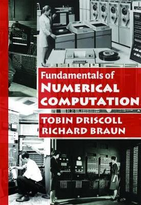

## Introduction

   Fundamentals of Numerical Computation is an advanced undergraduate-level introduction to the mathematics and use of algorithms for the fundamental problems of numerical computation: linear algebra, finding roots, approximating data and functions, and solving differential equations. 

## Material

1. Hands on: 
   * [MATLAB Install](/PDF/courses/TA/ICM/2018_09_12_Install_MATLAB.pdf)
   * [MATLAB Onramp](/PDF/courses/TA/ICM/2018_09_17a_Introduction_to_Matlab.pdf)
   * [Lab 1A: Conditioning](/PDF/courses/TA/ICM/2018_09_19a_Lab1A_Conditioning.pdf)
   * [Lab 1B: Stability](/PDF/courses/TA/ICM/2018_09_19b_Lab1B_Stability.pdf)

2. Lecture Notes: 

## Text Book

   * Fundamentals of Numerical Computation 
     <small>Tobin A. Driscoll, Richard J. Braun</small>  
     {:height="20%" width="20%"} 

## Link

   * [Course Page](https://sites.google.com/view/icmfall2018/home) 

