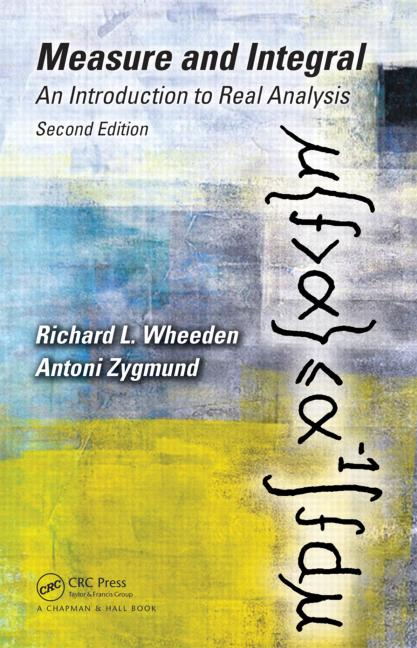

## Introduction

Real analysis is the basis of advanced analysis theory, and is also an important tool commonly used in other fields, such as harmonic analysis, partial differential equations, probability theory and so on. 

## Assignment

   <big><b>2018-1</b></big> 

   * Chapter 1: Preliminaries 
   * Chapter 2: Functions of Bounded Variation and the Riemann–Stieltjes Integral 
   * Chapter 3: Lebesgue Measure and Outer Measure 
    [Hw1](/PDF/courses/subjects/real_analysis/107_1_Hw1.pdf), &nbsp; [Hw2](/PDF/courses/subjects/real_analysis/107_1_Hw2.pdf)
   * Chapter 4: Lebesgue Measurable Functions 
    [Hw3](/PDF/courses/subjects/real_analysis/107_1_Hw3.pdf), &nbsp; [Hw4](/PDF/courses/subjects/real_analysis/107_1_Hw4.pdf)
   * Chapter 5: The Lebesgue Integral 
    [Hw5](/PDF/courses/subjects/real_analysis/107_1_Hw5.pdf), &nbsp; [Hw6](/PDF/courses/subjects/real_analysis/107_1_Hw6.pdf)
   * Chapter 6: Repeated Integration 
    [Hw7](/PDF/courses/subjects/real_analysis/107_1_Hw7.pdf), &nbsp; [Hw8](/PDF/courses/subjects/real_analysis/107_1_Hw8.pdf)
   * Chapter 7: Differentiation 
    [Hw9](/PDF/courses/subjects/real_analysis/107_1_Hw9.pdf), &nbsp; [Hw10](/PDF/courses/subjects/real_analysis/107_1_Hw10.pdf)  

   <big><b>2018-2</b></big> 

   * Chapter 8: $$L^p$$ Classes 
    [Hw1](/PDF/courses/subjects/real_analysis/107_2_Hw1.pdf)
   * Chapter 9: Approximations of the Identity and Maximal Functions 
    [Hw2](/PDF/courses/subjects/real_analysis/107_2_Hw2.pdf)
   * Chapter 10: Abstract Integration 
    [Hw3](/PDF/courses/subjects/real_analysis/107_2_Hw3.pdf), &nbsp; [Hw4](/PDF/courses/subjects/real_analysis/107_2_Hw4.pdf), &nbsp; [Hw5](/PDF/courses/subjects/real_analysis/107_2_Hw5.pdf), &nbsp; [Hw6](/PDF/courses/subjects/real_analysis/107_2_Hw6.pdf) 
   * Chapter 11: Outer Measure and Measure 
    [Hw7](/PDF/courses/subjects/real_analysis/107_2_Hw7.pdf), &nbsp; [Hw8](/PDF/courses/subjects/real_analysis/107_2_Hw8.pdf), &nbsp; [Hw9](/PDF/courses/subjects/real_analysis/107_2_Hw9.pdf)
   * Supplement: Introduction to the theory of distributions (Chapter 1 - 2) 
    [Hw10](/PDF/courses/subjects/real_analysis/107_2_Hw10.pdf)  

   <big><b>2019-1</b></big> 

   * Chapter 1: Measure Theory 
    [Hw1](/PDF/courses/subjects/real_analysis/108_1_Hw1.pdf), &nbsp; [Hw2](/PDF/courses/subjects/real_analysis/108_1_Hw2.pdf), &nbsp; [Hw3](/PDF/courses/subjects/real_analysis/108_1_Hw3.pdf), &nbsp; [Hw4](/PDF/courses/subjects/real_analysis/108_1_Hw4.pdf) 
   * Chapter 2: Integration Theory 
    [Extra Hw](/PDF/courses/subjects/real_analysis/108_1_Extra_Hw_Ch2.pdf)  

## Text Book

   1. (2018)  Measure and Integral: An Introduction to Real Analysis 
      <small>Richard L. Wheeden and Antoni Zygmund, Second Edition</small>  
      {:height="30%" width="30%"}   
   2. (2018-2) Introduction to the theory of distributions 
      <small>F. G. Friedlander and  M. Joshi, Second Edition</small>  
      {:height="30%" width="30%"}   
   3. (2019-1) Real Analysis 
      <small>Elias M. Stein and Rami Shakarchi</small>  
      {:height="30%" width="30%"}   

