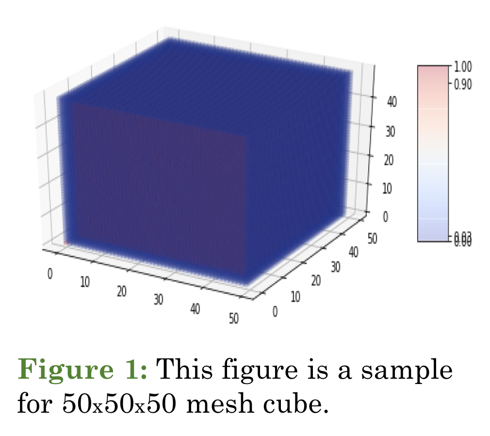
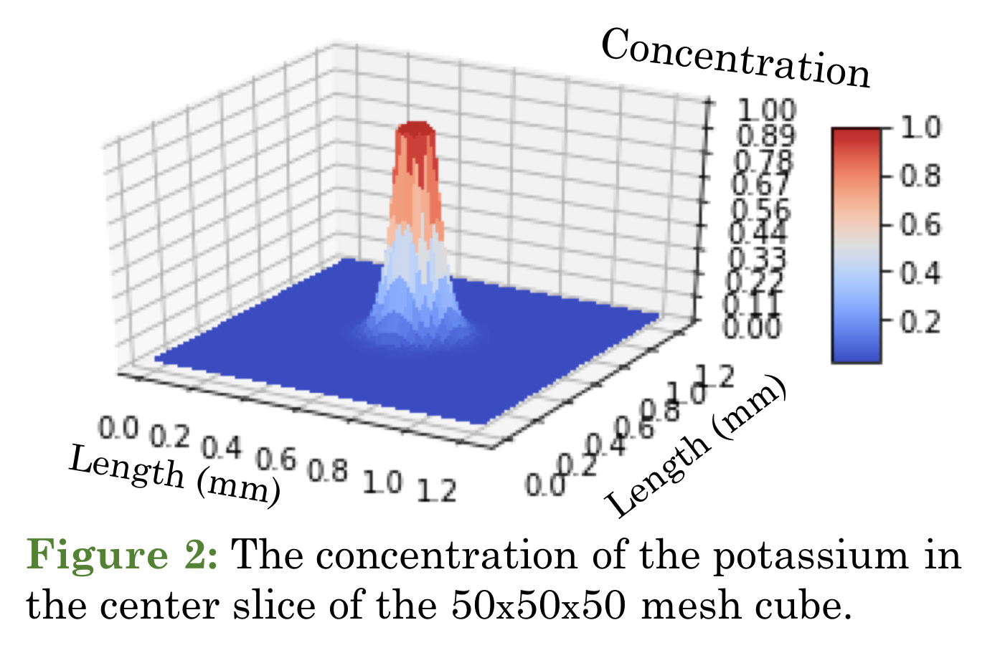
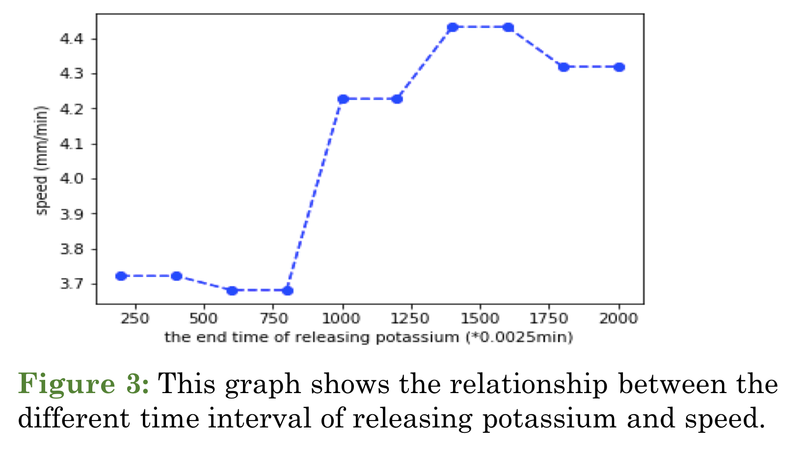
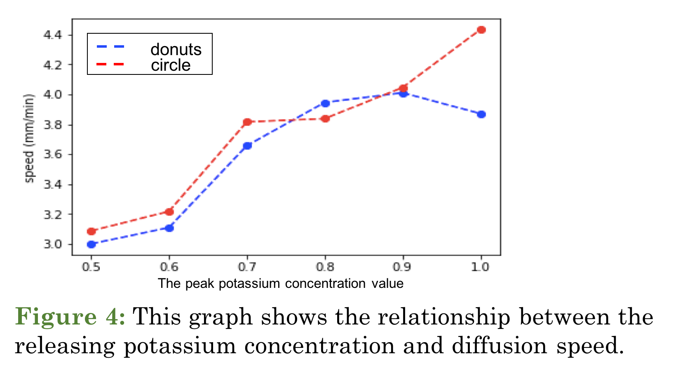
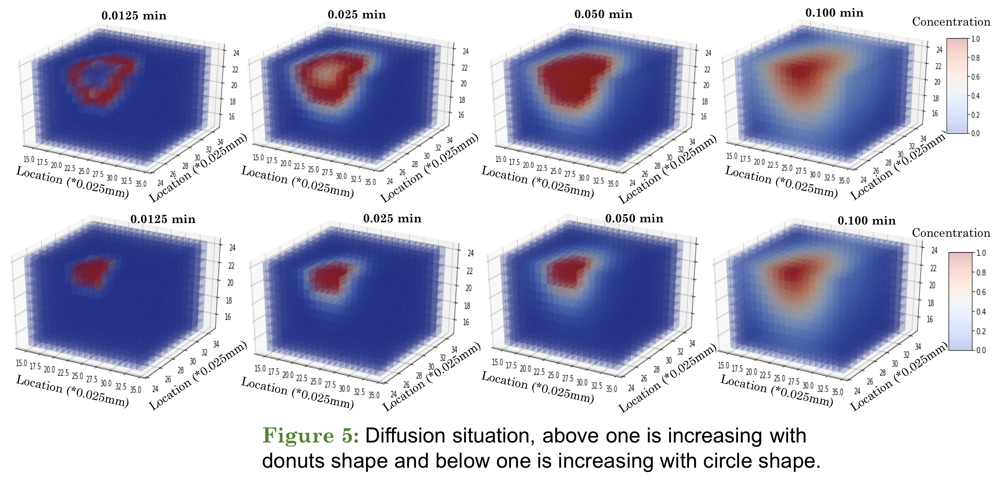
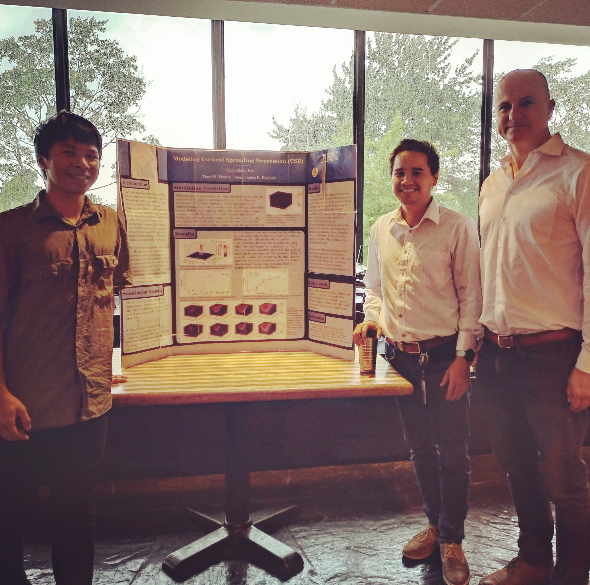

## Introduction

   Cortical spreading depression (CSD) is an electrical silent wave across all over the cerebral cortex and impairs some cortical activities. This cortical transmission inhibition is hypothesized to be strongly correlated with a number of neurological disorders. In addition to a series of animal and human brain photographic imaging (PET) studies, recent functional magnetic resonance imaging (functional MRI) and brain magnetic (magnetoencephalography) studies also support this hypothesis.

   The precise physiological events involved in CSD are not totally understood, however the most generally accepted hypothesis is that the exceed releases of ionic species such as potassium ($$K^+$$) and neurotransmitters, possibly glutamate, is a key event. Here, we describe a reactiondiffusion model in three-dimensional space and study the change in extracellular potassium.

## Simulation Method

   The Finite Difference method was implemented in Python (IPython) to simulate the diffusion equation (Fick’s law) of potassium in CSD model. The equation is 

   $$ \frac{\partial K}{\partial t} = D \nabla^2 K + f(K) $$

where $$K$$ is the concentration of potassium in location $$(x,y,z)$$, $$\nabla^2$$ is Laplacian operator, $$D$$ is the coefficient of potassium diffusion and $$f(K)$$ represents the local dynamics of extracellular potassium.

## Simulation Condition

Without loss of generality, we take $$50 \times 50 \times 50$$ mesh cube to simulate CSD model, and each grid cell is 0.025 mm $$\times$$ 0.025 mm $$\times$$ 0.025 mm. Initially, we let the potassium concentration of all elements start with 0.03, set each time step to 0.0025 min. and do 2000 ticks (iterations) in our experiment. To simulate the cell channel opening, we locate the channel at the center of the cube, assume the channel is the circle with radius 0.025 mm ~ 0.125 mm and clamp the center value using a value between 0.5 ~ 1.0.  

## Results

In this simulation, we focused on the diffusion of potassium ions in the brain and the rate of diffusion. The 3D mesh cube is used to represent the effect on the neighboring area when the ion channel is turned on. In Fig. 2, we present the situation after 0.05 minutes of opening the ion channel. The position of Fig. 2 is in the center slice of the mesh cube, and we raise the value of the center circle to simulate the channel release ion, and also fix the radius of the circle to 0.075 mm.  

 In Fig. 3, the model suggests there is a critical threshold for modifying the wave speed. Importantly, there is a non-linear relationship between the wave speed and the intensities of potassium elevation. The speed of the diffusion wave will keep raising, if the cell channel continues opening. The potassium level being used in the model is an abstract representation of changes in potassium from a baseline value, and because of that it can be rescaled to reflect the change at the physiological range.  

 In Fig. 4, two different shapes of the sources both generate a non-linear relationship between the level of $$K^+$$ and the wave speed. However, at a strong elevation, one form can provide a stronger change in wave speed than the other.  

## References

   1. James A. Reggia & David Montgomery, *Modeling Cortical Spreading Depression* 
   2. H. Kager, W. J. Wadman & G. G. Somjen, *Conditions for the Triggering of Spreading Depression Studied With Computer Simulations* 

## Material

   * [Poster](./../../../PDF/projects/IBM/IBM_poster.pdf)
   * PPT
        1. [Introduction of My Background](./../../../PDF/projects/IBM/IBM_Intro.pdf)
        2. [Project Presentation](./../../../PDF/projects/IBM/IBM_project.pdf)
   * GitHub (I will modify the code to new version.)

## Acknowledgements
   I would like to thank [Dr. James R. Kozloski](https://researcher.watson.ibm.com/researcher/view.php?person=us-kozloski) and [Dr. Tuan M. Hoang Trong](https://researcher.watson.ibm.com/researcher/view.php?person=us-tmhoangt)
who contributed to this research during the summer vacation in 2018.  

## Extension
  * Intoduction of this project
    1. [TED@IBM](https://www.ted.com/talks/james_kozloski_why_the_brain_is_simpler_than_we_think#t-18096)
    2. [IEEE.tv](https://ieeetv.ieee.org/conference-highlights/brain-panelist-james-kozloski-2016-technology-time-machine)

