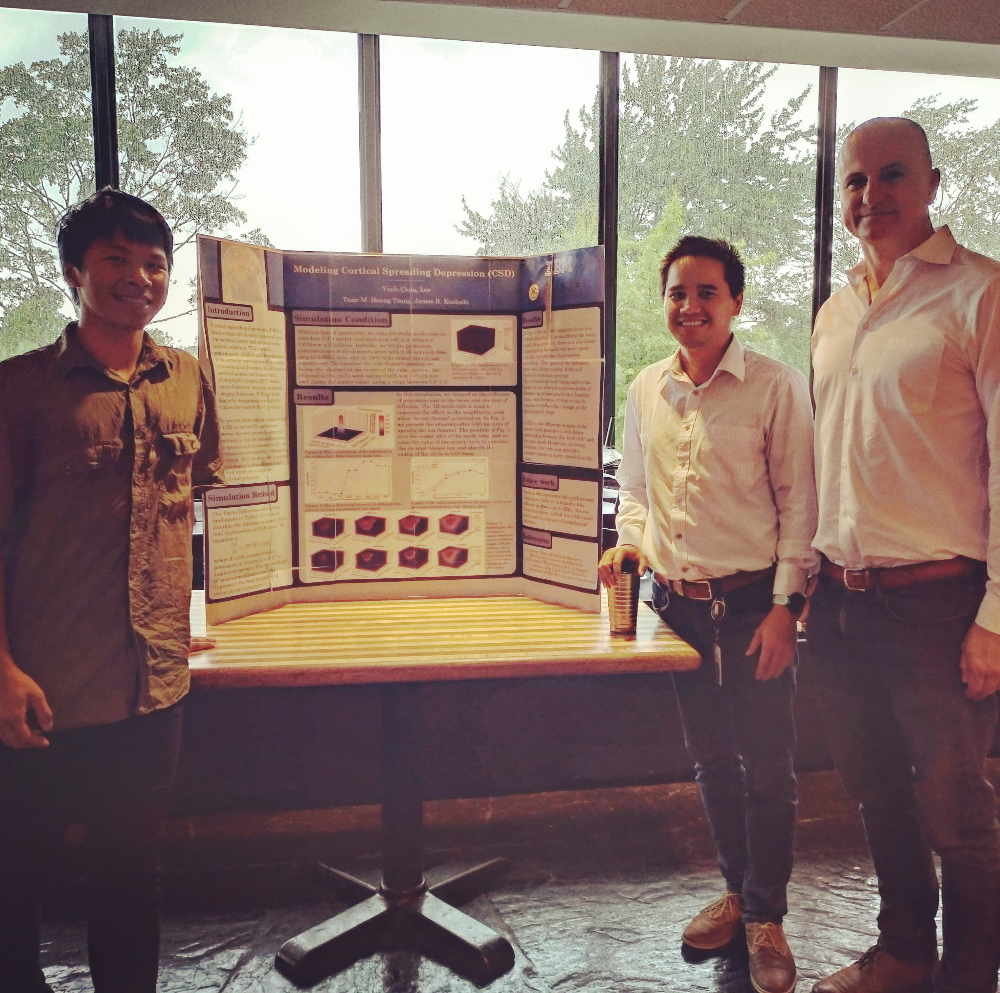

## Introduction

   Cortical spreading depression (CSD) is an electrical silent wave across all over the cerebral cortex and impairs some cortical activities. This cortical transmission inhibition is hypothesized to be strongly correlated with a number of neurological disorders. In addition to a series of animal and human brain photographic imaging (PET) studies, recent functional magnetic resonance imaging (functional MRI) and brain magnetic (magnetoencephalography) studies also support this hypothesis.

   The precise physiological events involved in CSD are not totally understood, however the most generally accepted hypothesis is that the exceed releases of ionic species such as potassium (K+) and neurotransmitters, possibly glutamate, is a key event. Here, we describe a reactiondiffusion model in three-dimensional space and study the change in extracellular potassium.

## Simulation Method

## Simulation Condition

## Results

## References

## Code

   * GitHub

## Poster

   * [PDF](./../../../PDF/projects/IBM/IBM_poster.pdf)

## Acknowledgements
   I would like to thank Dr. James R. Kozloski and Dr. Tuan M. Hoang Trong
who contributed to this research during the summer vacation in 2018.  

{:height="50%" width="50%" align="center"}

